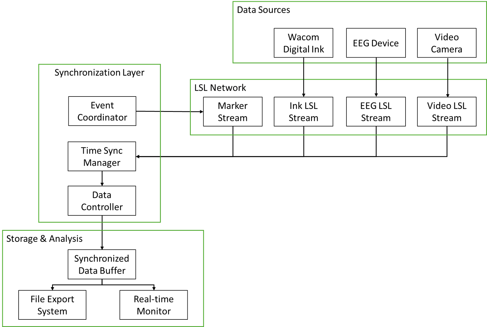

# 繪畫影片 EEG 同步收集平台 - 專案流程規劃

## 專案概述

本專案旨在開發一個多模態數據同步收集平台，能夠同時記錄：

- 數位墨水數據：繪圖過程中的筆跡軌跡、壓力、傾斜等
- EEG 腦電信號：繪畫過程中的大腦活動
- 影片記錄：繪畫行為的視覺記錄
  透過 LSL（Lab Streaming Layer）技術實現亞毫秒級的時間同步，為神經科學研究提供高精度的多模態數據。

## 第一階段：數位墨水數據讀取與處理

### 目標

建立穩定的數位墨水數據處理管線，能夠即時處理 Wacom 繪圖板的輸入數據。

### 關鍵技術

- PyQt5：使用 PyQt5實現GUI設計與Wacom墨水數據收集
- 即時數據處理：多執行緒架構處理高頻率輸入數據
- 筆劃檢測：自動識別筆劃開始、進行中、結束狀態

### 主要功能

- 數據擷取：從繪圖設備獲取原始座標、壓力、傾斜角度
- 特徵計算：即時計算筆速、加速度、筆劃長度等衍生特徵
- 事件檢測：識別筆劃邊界、暫停、重新開始等繪畫事件
- 數據緩衝：建立高效的數據緩衝機制，避免數據丟失

### 預期輸出

- 結構化的墨水點數據（座標、壓力、時間戳）
- 筆劃層級的統計資訊（長度、持續時間、平均壓力）
- 繪畫事件標記（開始、結束、暫停）

## 第二階段：建立繪圖過程的 LSL Stream

### 目標

將處理後的數位墨水數據轉換為 LSL 串流格式，實現與其他設備的時間同步。

### 關鍵技術

- LSL 串流協議：建立符合 LSL 標準的數據串流
- 時間戳同步：使用 LSL 統一時間基準
- 事件標記系統：創建結構化的實驗事件標記

### 主要功能

- 串流建立：
  - 墨水數據串流（9 通道：x, y, pressure, tilt_x, tilt_y, velocity, stroke_id, event_type, color）
  - 事件標記串流（筆劃開始/結束、任務階段標記）
- 數據格式化：
  - 標準化座標系統（0-1 範圍）
  - 統一時間戳格式
  - 設備 metadata 設定
- 品質控制：
  - 數據完整性檢查
  - 串流延遲監控
  - 錯誤處理機制
- 預期輸出
  - 即時 LSL 墨水數據串流
  - 同步的事件標記串流
  - 串流品質報告

### 編譯獨立執行檔

- 創建一個名為Wacom的根目錄，並將專案clone到此
- 進入以下目錄: Wacom/sys_dev/Phase2_wsv2
- 執行python -m PyInstaller WacomDigitalInk.spec
- 執行檔會放在以下目錄: Wacom/dist

## 第三階段：同步串流 EEG 與影片數據 (pending)

### 目標

整合所有數據源，建立完整的多模態同步收集系統。

### 關鍵技術

- 多串流同步：協調 EEG、墨水、影片三種數據源
- 時間對齊算法：後處理時間同步校正
- 即時監控系統：實驗過程中的數據品質監控

### 主要功能

3.1 EEG 數據整合

- 自動偵測 EEG 設備 LSL 串流
- EEG 數據品質即時監控
- 繪畫事件的時間對齊

  3.2 影片同步記錄

- 高解析度影片錄製（可設定 fps 和解析度）
- 影片幀時間戳 LSL 串流
- 影片與其他數據的時間同步

  3.3 實驗控制系統

- 實驗階段管理：基線期、繪畫任務、休息期
- 事件標記系統：任務開始/結束、特殊事件標記
- 即時數據監控：各串流狀態、同步品質檢查

  3.4 數據匯出與分析

- 同步數據匯出：CSV、JSON、HDF5 格式
- 時間對齊報告：同步精度分析
- 數據完整性檢查：遺失數據檢測與補償

### 預期輸出

- 完整的多模態同步數據集
- 實驗時間軸與事件標記
- 數據品質與同步精度報告

## 技術架構

### 系統架構圖

### 關鍵技術指標

- 時間同步精度：< 1ms
- 數據採樣率：
  - EEG：250-1000 Hz
  - 數位墨水：100-200 Hz
  - 影片：30-60 fps
- 延遲控制：端到端延遲 < 10ms
- 數據完整性：> 99.9%

## 實作時程規劃

### Phase 1（2 週）：數位墨水處理

- Universal Ink Library 整合
- 基本數據處理管線
- 筆劃檢測算法實作

### Phase 2（2 週）：LSL 串流建立

- LSL 串流架構設計
- 事件標記系統
- 初步同步測試

### Phase 3（3 週）：多模態整合

- EEG 串流整合
- 影片同步系統
- 完整實驗控制介面

### Phase 4（1 週）：測試與優化

- 系統整合測試
- 效能優化
- 文件撰寫
